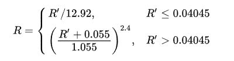
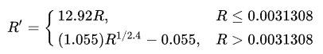
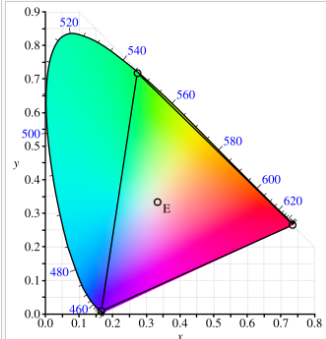
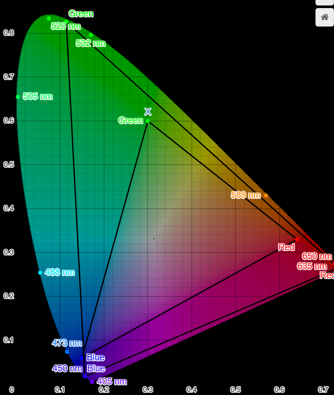
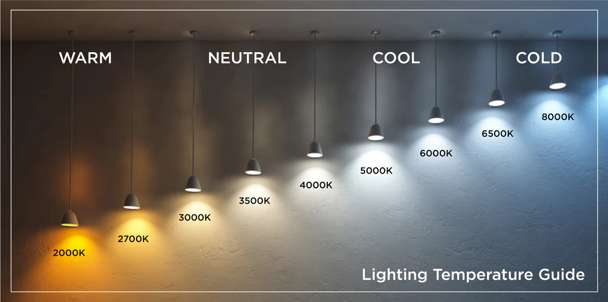
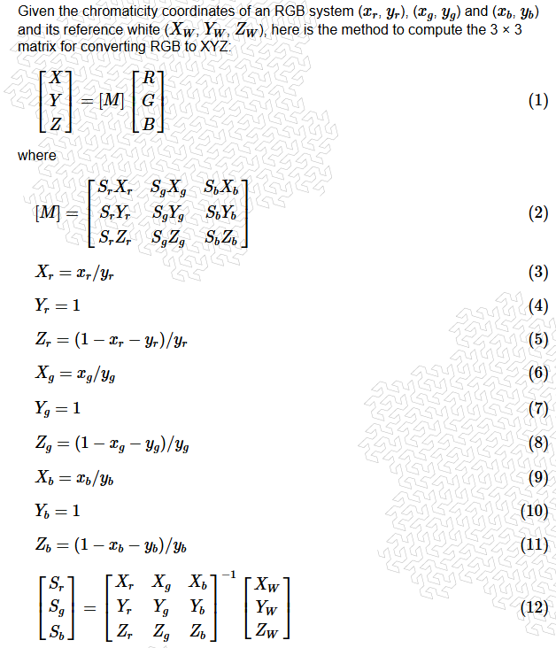
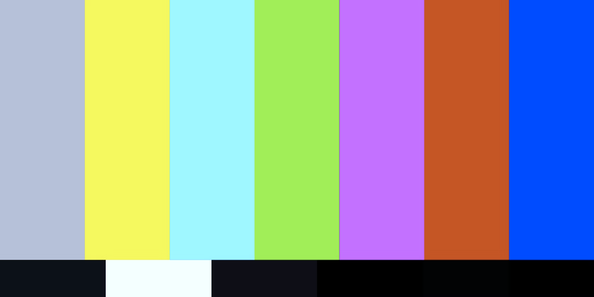
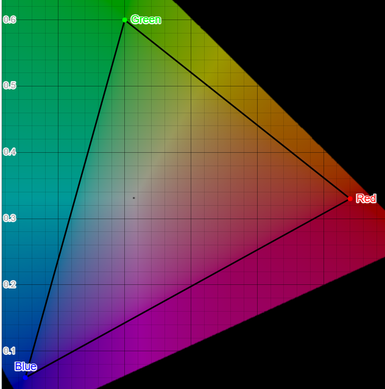
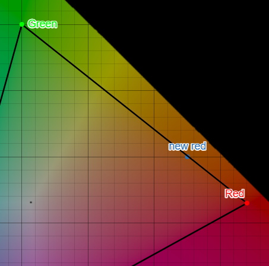
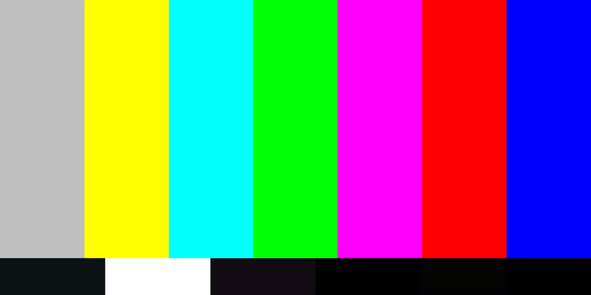

# Simulating Color Calibration Issues
### Color Explorer Program


In order to understand display color calibration on a technical level, I decided to write a program that would simulate a miscalibrated display. What this means at a low level is to take an image, convert it to a different color space, then write that to a new image, yielding a result that is the same image but with slightly different colors. In reality, I am viewing two different images on the same display. This is different from a real miscalibrated display, where I would be viewing the same image on two different displays, one of which is miscalibrated. But the effect is the same and serves as a sandbox to understand the math involved in color spaces and color calibration.

In the case of my program, I convert an image from an sRGB color space to some other color space, and then write the converted pixel data to a new sRGB image. Because it was converted to a new color space yet still saved as the original color space, the new image appears as if it's being displayed on a miscalibrated display.


How does this program work? What concepts and math are involved?

At a high high high level: **For each pixel in an image, convert pixel from color space A to XYZ to color space B. Write all resulting pixels to new image** 

*(XYZ is a device-independent color space. It will be explained further below)*

### Zoomed in a bit more 
#### (breaking down what these conversion steps involve)

1. Convert pixel from color space A to XYZ
   1. Input: pixel in range 0-255
   2. Normalize to range 0.0-1.0
   3. Convert to linear RGB (decode gamma)
   4. Convert to XYZ
2. Convert from XYZ to color space B (do the above process in reverse, for a different color space)
   1. Convert to linear RGB (encode gamma)
   2. Convert from normalized range 0.0-1.0 to range 0-255
   3. Final result: pixel in range 0-255

### Zoomed in even further
#### (Diving into the math & concepts involved)

<u>Convert to linear RGB:</u>
This is necessary to encode/decode luminance aka gamma in images. This is due to the fact that humans perceive light non-linearly, while cameras perceive it linearly. This is something I still don't understand very well, but in order to accomplish this in the code, the following is implemented as a function for both decoding and encoding:


##### Gamma Decode

```cpp
float inverseTransferFunction(float value) {
    /*
    Source: https://en.wikipedia.org/wiki/SRGB#Transfer_function_(%22gamma%22)
    */
    if (value <= 0.04045) return value / 12.92;
    else return std::pow(((value + 0.055)/1.055), 2.4);
}
```

##### Gamma Encode

```cpp
float transferFunction(float value) {
    /*
    Source: https://en.wikipedia.org/wiki/SRGB#Transfer_function_(%22gamma%22)
    */
   if (value <= 0.0031308) return value * 12.92;
   else return 1.055*std::pow(value, 1/2.4) - 0.055;
}
```


<u>Convert to XYZ:</u>

*(Note: The notation used i.e. xyY vs XYZ is confusing, so be mindful of lower- vs upper-case)*

This notation comes from the **CIE 1931 chromaticity diagram** which defines the relationship between the visible spectrum and human color vision. This is a mathematical model that comprise a "standard observer", which is a static idealization of the color vision of a normal human (Definition from wiki that almost seems too technical to be useful).

**Color spaces** exist within this diagram. They're drawn as a triangle, where each point of the triangle is a **primary** (defined below). A color space is a specific, organized model for representing colors numerically. It's a mapping of values eg. RGB(123, 93, 74) to a specific perceived color, as humans would see it. A given RGB value may represent a different perceived color in one space vs another.

In other words, a bunch of really smart color nerds made a graph that maps out the colors that humans can see. And a bunch of other really particular tech people defined certain color spaces that work well for what they're working on (movies, photography, computers, etc.)




<sub>The triangle represents a given **color space** (in this case, the CIE RGB color space; there are many different color spaces that have been defined for various things like computers, photography, movies, etc.)</sub>

An interactive diagram can be found [here](https://www.desmos.com/calculator/14atiy4bef)


The (x,y) coordinates on this 2D diagram represent the **chromaticity** of a given color: the objective, brightness-independent quality of color, defined by its hue and saturation. Technically, this diagram is actually 3D with the third axis being luminance. These 3 values are represented by xyY where (x,y) is, again, the chromaticity, and Y is luminance.

*(Note: it's not accurate to say x is hue and y is saturation, nor vice versa. x and y simply encode hue and saturation-like aspects of color. Hue and saturation are more of abstract perceptual notions derived from chromaticity, but you can't map them to x or y directly)*

This is different from XYZ, which represents the **tristimulus values**, and can be thought of as a *device-independent color*. This is the value of a color in an arbitrary RGB space after gamma is removed. Y is *roughly* luminance, while X and Z together encode the color's "mix" of red/green/blue (in a device-independent way).


So in the calculations, XYZ is really what we get first, and we can, if we wish, go a step further to remove luminance to get the chromaticity, which is the (x,y) coordinate on the 1931 CIE diagram and use that to plot the color (but in the process of converting from one RGB color space to another, we don't calculate the chromaticity and instead use the XYZ result as the "turn around" point). When the luminance has been removed and we're left with just an (x,y), this means different colors can map to the same point on the 2D diagram: eg. two reds that have different levels of brightness can have the same chromaticity and therefore the same (x,y) coordinates.


To actually convert from linear RGB to XYZ, we use a **color conversion matrix**. [This is the article](http://www.brucelindbloom.com/index.html?Eqn_RGB_XYZ_Matrix.html) I referenced for the math. This article gives a lot of computed matrices for various RGB spaces, but because I wanted to create and tweak arbitrary color spaces, I needed to implement the matrix calculation myself. There's a math example below to explain how to compute a matrix and where to find the input values. But briefly, we can look at a pre-computed matrix. For example, the sRGB conversion matrix:
```
0.4124564  0.3575761  0.1804375
0.2126729  0.7151522  0.0721750
0.0193339  0.1191920  0.9503041
```

A matrix like this is used to convert from a linear RGB to XYZ:

`XYZ = M * L`
<sub>(where *L* is a 3D linear RGB value like (0.5, .2, .3), for example, and XYZ is a 3D value)</sub>

The inverse of a matrix like this is used to convert from XYZ to linear RGB:

`L = M * XYZ`

#### Other concepts/terms

<u>Gamut</u>: The specific range of colors within a color space.
For example, here is the sRGB gamut (smaller triangle) vs the wide-gamut RGB gamut (bigger triangle):





<u>Primaries</u>: A color space has a red primary, green primary, and blue primary. These define what the color space actually *is*. In other words, in this color space, what does a fully saturated red look like? What about green? what about blue? It's important to remember that "red" is not an objective color; in fact it's quite ambiguous. There are many different colors that could all be considered red. So in a color space, which *specific, real-life, perceived* red should be considered the *ultimate* red? This is what a primary is. It's a specific color on the CIE 2D diagram that represents what color is mapped to (255, 0, 0), and similarly for green and blue. In the above gamut image, each corner of the triangles is a primary.

<u>White point</u>: Very similar to primaries, but instead of being the color mapped to the digital code where one channel is maxed and the other two are 0 (eg. (255, 0, 0) for red, (0, 255, 0) for green, (0, 0, 255) for blue), it's the color when all 3 channels are maxed i.e. (255, 255, 255). It defines what combination of the red, green, and blue primaries is considered neutral white. You'll often seen white points with names like D50, D65, D93, etc. These are values defined by the CIE to approximate different kinds of natural daylight spectra. D = daylight, 65 = 6500K (Kelvins are used as the unit for color temperature)



<sub>Examples of different whites</sub>

#### Example
Let's now walk through an example of the math/process involved to explain more pieces involved.

We'll start with computing the color conversion matrix since it's the most involved:

<u>Computing the color conversion matrix:</u>

Let's use the sRGB color space, since a) that's the color space used by computers and b) it's already computed in the [previously linked article](http://www.brucelindbloom.com/index.html?Eqn_RGB_XYZ_Matrix.html) so we can check our answer.
We need a few pieces to start: the red, green, and blue primaries for the color space, as well as the white point.
I was able to find these values on the [sRGB Wikipedia page](https://en.wikipedia.org/wiki/SRGB#Primaries):


||Red|Green|Blue|White Point|
|--|---|-----|----|-----------|
|x|.6400|.3000|.1500|.3127|
|y|.3300|.6000|.0600|.03290|
|Y|.2126|.7152|.0722|1.000|


We can then use these values in the following steps from [this article linked previously](http://www.brucelindbloom.com/index.html?Eqn_RGB_XYZ_Matrix.html):



Variable notation is as follows: `xr = cell from above table in row x, colum Red`, and so on. 

*Note: the values from the table are lower case. The upper case values are calculated by us using the table values.*

One thing that this article didn't explain well is what Xw, Yw, and Zw are. 

These are calculated the same way as the other X, Y, and Z values i.e.:

```
Xw = xw/yw
Yw = 1
Zw = (1 - xw - yw) / yw
```

(The article's steps seemed to me to be in a weird order, but once I figured out what Xw, Yw, and Zw are, I was able to follow along and implement it in the code).

C++ implementation: 

```cpp
Eigen::Matrix3d calcConversionMatrix(float xr, float yr, float xg, float yg, float xb, float yb, float xw, float yw) {
    /*
    Args: chromaticity coordinates of given RGB system

    Source for math: http://www.brucelindbloom.com/index.html?Eqn_RGB_XYZ_Matrix.html

    Terms for variables:
    Primaries: xr, yr, xg, yg, xb, yb
    White point: xw, yw
    XYZ unscaled: Xr, Yr, Xg, Yg, Xb, Yb
    XYZ white point: Xw, Yw
    */

   /* Convert RGB primaries to XYZ (unscaled) */
   float Xr = xr/yr;
   float Yr = 1;
   float Zr = (1-xr-yr)/yr;
   
   float Xg = xg/yg;
   float Yg = 1;
   float Zg = (1-xg-yg)/yg;

   float Xb = xb/yb;
   float Yb = 1;
   float Zb = (1-xb-yb)/yb;

   /* Convert white point to XYZ (unscaled) */
   float Xw = xw/yw;
   float Yw = 1;
   float Zw = (1-xw-yw)/yw;

    /* Put unscaled XYZ values in matrix */
    Eigen::Matrix3d m;
    m << Xr, Xg, Xb,
         Yr, Yg, Yb,
         Zr, Zg, Zb;

    Eigen::Matrix3d mInv = m.inverse();

    /* Put unscaled XYZ white point values in vector */
    Eigen::Vector3d vecW;
    vecW << Xw, Yw, Zw;

    /* Calculate scaling vector.
    These values are also the luminance
    values for converting from RGB to CIE.
    These values end up as the Y component of each
    column in the final "result" matrix.
    (This is something I still don't fully understand)
    See example (for sRGB): 
    https://en.wikipedia.org/wiki/SRGB#Primaries */
    Eigen::Vector3d vecS = mInv * vecW;

    /* Extract the scaling factors */
    float Sr = vecS.x();
    float Sg = vecS.y();
    float Sb = vecS.z();

    /* Put together final color conversion matrix using the
    unscaled XYZ chromaticities and the scaling factors */
    Eigen::Matrix3d result;
    result << Sr*Xr, Sg*Xg, Sb*Xb,
              Sr*Yr, Sg*Yg, Sb*Yb,
              Sr*Zr, Sg*Zg, Sb*Zb;

    return result;
}
```

To reiterate what was said earlier, once you have a color conversion matrix (let's call it *M*), to convert a given RGB value to XYZ, you have to: normalize to 0-1, convert to linear (aka decode gamma), then do M * L and this yields the XYZ value. 

Because XYZ is a device-independent representation of a color, we can then convert from XYZ to any conceivable color space. Once save it as an sRGB image again, it will give the effect of being shown on a miscalibrated display.

Understanding and implementing the calculation of a color conversion matrix was honestly the biggest effort. Once that's done, the rest of it isn't too bad.


### <u>The rest of it:</u>

Let's use an sRGB value of (255, 0, 0) as the starting value and let's convert it to Wide-Gamut RGB (abbreviated WGRGB). As the name indicates, WGRGB has a wider range of colors, shown again in this image:


Because of that, we should expect that what is considered a fully saturated red in sRGB is a relatively less intense red in WGRGB. Let's keep that intuition in mind as we go through the process of converting.

Pasting the general process again as a reference:

1. Convert pixel from color space A to XYZ
   1. Input: pixel in range 0-255
   2. Normalize to range 0.0-1.0
   3. Convert to linear RGB (decode gamma)
   4. Convert to XYZ
2. Convert from XYZ to color space B (do the above process in reverse, for a different color space)
   1. Convert to linear RGB (encode gamma)
   2. Convert from normalized range 0.0-1.0 to range 0-255
   3. Final result: pixel in range 0-255

First step is to convert from a range of 0-255 to 0.0-1.0.
Simply divide the color channels by 255:
```cpp
/* Normalize RGB */
float rN = r / 255.0;
float gN = g / 255.0;
float bN = b / 255.0;
```
**Result: (1.0, 0.0, 0.0)**

Convert to linear RGB:
This is as simple as plugging in each normalized color channel into the gamma decode function:
```cpp
/* Convert to linear RGB (decode gamma) */
float rL = inverseTransferFunction(rN);
float gL = inverseTransferFunction(gN);
float bL = inverseTransferFunction(bN);
```
where inverseTransferFunction is:
```cpp
float inverseTransferFunction(float value) {
    /*
    Source: https://en.wikipedia.org/wiki/SRGB#Transfer_function_(%22gamma%22)
    */
    if (value <= 0.04045) return value / 12.92;
    else return std::pow(((value + 0.055)/1.055), 2.4);
}
```
**Result: (1.0, 0.0, 0.0) (unchanged, but this isn't always the case)**

Convert to XYZ:
This is where we do M * L (where M is the conversion matrix already computed and L is the linear RGB)
```cpp
/* Convert to CIE XYZ (aka device-independent values) */
Eigen::Vector3d linearRGB{rL, gL, bL};
Eigen::Vector3d CIE_XYZ = colorSpace.matrix * linearRGB;
```

**Result: (.412391, 0.212639, 0.19330)**

This can be verified on online calculators [like this one](http://www.brucelindbloom.com/index.html?ColorCalculator.html).
Because chromaticity is more intuitive than XYZ (i.e. it can be plotted on the CIE diagram), I'll go one extra step here to convert XYZ to chromaticity just to get an extra spot check that this XYZ result is correct.

Convert XYZ to xy: (chromaticity is technically xyY but we often only care about xy for the purpose of plotting):
```cpp
float x = X / (X + Y + Z);
float y = Y / (X + Y + Z);
```
(tbh this is one calculation that I don't really fully understand the intuition for, but I do know that it's correct, lol)

**Result: (0.64, .33). Again, verifiable using the calculator previously linked. If you plot this value on the [Desmos interactive graph](https://www.desmos.com/calculator/14atiy4bef) you'll see that it's the same point as defined by the sRGB red primary.**

So now we take the XYZ and "turn around" in the process, meaning that we do the same process in reverse and using a different color space (in this case, Wide-Gamut RGB).

Convert to linear RGB:
Before, converting from linear RGB to XYZ was done by multiplying the conversion matrix by the linear RGB value. Now, we need to use the inverse of the conversion matrix (of the other color space--the one we're converting to).
```cpp
/* Convert from CIEXYZ to linear RGB */
Eigen::Vector3d linearRGB = colorSpace.matrix.inverse() * CIEXYZ;
float rL = linearRGB[0];
float gL = linearRGB[1];
float bL = linearRGB[2];
```
**Result: (.559, .094, .019)**

Encode gamma:
We just need to plug the linear values into the gamma encode function:
```cpp
/* Encode gamma */
/* N because these are still normalized (i.e. in range 0.0 - 1.0) */
float rN = transferFunction(rL);
float gN = transferFunction(gL);
float bN = transferFunction(bL);
```
Where transferFunction is:
```cpp
float transferFunction(float value) {
    /*
    Source: https://en.wikipedia.org/wiki/SRGB#Transfer_function_(%22gamma%22)
    */
   if (value <= 0.0031308) return value * 12.92;
   else return 1.055*std::pow(value, 1/2.4) - 0.055;
}
```
**Result: (.773, .338, .146)**

Convert from 0.0-1.0 range to 0-255 range. We also want to clamp the values here (had a bug in my program before I figured this out):
```cpp
/* Convert to range 0 - 255 */
int r = rN * 255;
int g = gN * 255;
int b = bN * 255;

/* Clamp negative values */
r = std::max(0, r);
g = std::max(0, g);
b = std::max(0, b);

/* Clamp values over 255 */
r = std::min(r, 255);
g = std::min(g, 255);
b = std::min(b, 255);
```
**Result: (197, 86, 37)**

In line with our intuition about the final result being a less intense red due to converting to a color space with a wider gamut, the resulting color is indeed a muted red. 

Here's a comparison when this conversion is applied to an entire test image rather than a single pixel:


<br>


This is the effect I was after with this sandbox program. Both images are actually sRGB, since that's how the images are stored as well as displayed on my computer. But the conversion logic enables a simulated calibration to another space (in this example, Wide-Gamut RGB).

I'll do one more quick example with a user-defined color space eg. an orange-biased color space.
How to create an orange-biased color space?

Start with sRGB: 



Then move the red primary into the orange. It currently is at (.64, .33), so let's move it to (.55, .4).

Here's where that lands on the CIE diagram:



So we can define a new RGB color space by changing xr and yr, which if you recall are some of the inputs into the process of calculating a conversion matrix.

That's pretty much it. All I have to do is make sure I use this new conversion matrix when converting from XYZ to the new RGB space, and it gives the following result:

Original: <br>

<br>
Result:<br>


Wait a second, those images are identical!

Let's try another image...

Original: <br>

<br>
Result:<br>


What's going on here?

Because the orange biased color space has a smaller gamut than sRGB as far as red is concerned, when we are converting sRGB red to orangeBiasedRGB, the value is essentially wayyy past the max red for orangeBiasedRGB, meaning it gets clamped to 255. So the red in the color test image stays as red, but in the nature landscape photo, there's more reddish/orangeish colors that aren't at the edge of the gamuts, meaning they still have room to be converted, thus giving a different final result.


<hr>
Sources:

* https://en.wikipedia.org/wiki/Gamma_correction
* https://en.wikipedia.org/wiki/SRGB#Transfer_function_(%22gamma%22)
* https://en.wikipedia.org/wiki/CIE_1931_color_space
* https://www.desmos.com/calculator/14atiy4bef
* http://www.brucelindbloom.com/index.html?Eqn_RGB_XYZ_Matrix.html
* https://en.wikipedia.org/wiki/Wide-gamut_RGB_color_space
* http://www.brucelindbloom.com/index.html?ColorCalculator.html